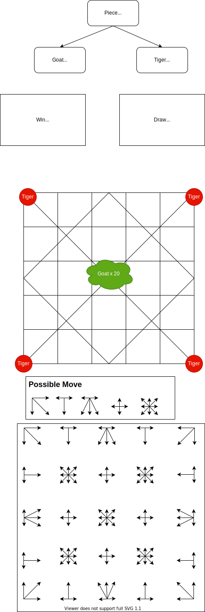

# Bagchal

**creating an old Nepali board game to procrastinate on building the bhetum app.😭**

### Todo

**Core game Logic**
- [ ] Make a 5x5 grid to create the game board
- [ ] Define valid move for the game. There are 5 possible move set. 
- [ ] Corner piece and edge piece (excluding middle edge piece) has 3 possible move
- [ ] Middle edge piece has 5 possible move
- [ ] Inner middle piece has 4 possible move
- [ ] inner center and inner corner piece has 8 possible move 
- [ ] goat cannot move before all 20 of them are placed in the board
- [ ] tiger can jump over adjacent goat in a straight line if there is an open space (like checker)
- [ ] end game if tiger eat 5 goats
- [ ] end game if tiger has no valid move left
- [ ] end game if both player repeat move 3 times

**Make it look pretty**
- [ ] Design the board to make it responsive and pretty
- [ ] Hover effects
- [ ] Add animation when piece move 
- [ ] Make tiger and goat svg look good
- [ ] Have dark and light theme
- [ ] 

**Nice to have**
- [ ] Create a bot to play against player using min-max algorithm
- [ ] Don't be to ambitious and create an AI for it. Min-max algorithm is good enough.
- [ ] Add multiplayer option by creating an invite link 
- [ ] Leader Board would be nice to have...
- [ ] Oauth2 google and github 

